<div align="center">

# finance.sh

**Controle financeiro open-source, self-hosted, em pt-BR.**

[](https://go.dev)
[](https://react.dev)
[](https://www.docker.com)
[](LICENSE)
[](CONTRIBUTING.md)
[](#)

</div>

> **finance.sh** é controle financeiro 100% open-source para **pessoa física**, **MEI** e **microempresa**. Self-hosted via Docker. Seus dados ficam no seu servidor. AGPL-3.0, sem lock-in, sem telemetria padrão, sem cartão de crédito pra começar.

```bash
git clone https://github.com/finance-sh/finance-sh && cd finance-sh
cp .env.example .env
docker compose up -d
# → http://localhost:8090
```

---

## Sumário

- [Por que existir](#por-que-existir)
- [Funcionalidades](#funcionalidades)
- [Screenshots](#screenshots)
- [Arquitetura](#arquitetura)
- [Stack tecnológica](#stack-tecnológica)
- [Estrutura do repositório](#estrutura-do-repositório)
- [Início rápido](#início-rápido)
- [Desenvolvimento local sem Docker](#desenvolvimento-local-sem-docker)
- [Primeiro acesso (setup wizard)](#primeiro-acesso-setup-wizard)
- [Esqueci a senha (sem SMTP)](#esqueci-a-senha-sem-smtp)
- [Variáveis de ambiente](#variáveis-de-ambiente)
- [Multi-organização](#multi-organização)
- [Reverse proxy](#reverse-proxy)
- [Segurança & LGPD](#segurança--lgpd)
- [Backups criptografados](#backups-criptografados)
- [Roadmap](#roadmap)
- [Contribuindo](#contribuindo)
- [Licença](#licença)

---

## Por que existir

O mercado brasileiro de controle financeiro pessoal e MEI é dominado por SaaS fechados — **Mobills**, **Organizze**, **Guiabolso**, **Conta Azul** — onde seus extratos, lançamentos e relatórios vivem na nuvem de outro, atrás de assinatura mensal, sujeitos à política e roadmap deles.

**finance.sh** propõe outra abordagem:

- **Auto-hospedado.** Roda no seu desktop, NAS, Raspberry Pi 4+, VPS ou homelab.
- **Open-source de verdade.** AGPL-3.0, código completo no GitHub.
- **Brasileiro de fato.** pt-BR primário, BRL como moeda primária, MEI/microempresa como personas de primeira classe.
- **Sem lock-in.** Export total em OFX/CSV/JSON/PDF/Excel a qualquer momento.
- **Docker-first.** Um `docker compose up -d` sobe stack inteiro. **2 containers** (app + Postgres), healthchecks, ~1 minuto no primeiro build.
- **LGPD por design.** Você é o controlador dos seus dados. Não tem terceiro pra processar nada — nem nós.

Inspirações honestas: [Firefly III](https://www.firefly-iii.org/), [Actual Budget](https://actualbudget.org/), [Maybe Finance](https://maybefinance.com/), [Ghostfolio](https://ghost.fo/). finance.sh é a vez brasileira disso — moderno, Docker-nativo, pt-BR-first.


## Funcionalidades

**Autenticação & segurança**
- **JWT** access + refresh com rotação, bcrypt, lockout de brute-force.
- **2FA TOTP** com códigos de recuperação; verificação de e-mail.
- **Criptografia de campo** AES-256-GCM para PII (notas, segredo 2FA).
- **LGPD**: consentimento versionado, "exportar meus dados", "excluir conta", PII mascarada em logs.
- **RBAC** granular: `owner`, `admin`, `member`, `viewer`.
- **Audit log** completo na UI de admin; soft delete em todas entidades.
- **Setup wizard** no 1º acesso (você cria o admin pela web — sem senha exposta).
- **Recuperar senha sem SMTP**: CLI `-reset-password`, link no log, ou reset por super-admin.

**Multi-organização**
- Mesma instância suporta múltiplas **organizações** (pessoal + PJ + família).
- **Criar novas orgs** pelas Configurações (ex.: Casa + Microempresa) + seletor pra trocar.
- Isolamento total de dados por `organization_id`.
- Convites de membros com escolha de papel.
- **Exportar / importar dados** (export JSON → importa numa org nova; migra entre instâncias).
- Super-admin opcional (read-only) pra ops da plataforma.

**Gestão financeira**
- Contas (banco, carteira, investimento, cartão).
- Transações: receita, despesa, transferência, com **contatos** vinculáveis.
- **Cartões de crédito** com **faturas** (fechamento → vencimento → pagar fatura) e **parcelamento**.
- **Contas a pagar/receber** com baixa (settle) e calendário de vencimentos.
- **Orçamentos** mensais por categoria.
- **Metas** de economia com progresso.
- **Recorrência** com regras (scheduler in-process gera ocorrências).
- **Tags** + **busca global** (⌘K) + **categorização automática** (regras + histórico).
- **Multi-moeda** por organização (15 moedas ISO-4217, BRL default).

**Análise & dados**
- **Dashboard** com gráficos (saldo, fluxo de caixa, gastos por categoria).
- **Projeção de fluxo de caixa** (N meses, alerta de saldo negativo).
- **Relatórios** + export **Excel / PDF / CSV**.
- **Anexos** de comprovante em transações, armazenados como **BYTEA em Postgres** (TOAST cuida da compressão out-of-line). Backup do DB cobre os anexos automaticamente.
- **Import OFX/CSV** de extrato com dedup + categoria sugerida.

**Plataforma**
- **PWA** instalável (offline shell, auto-update).
- **i18n** pt-BR / en / es.
- **Modo privacidade** (oculta valores no dashboard, tipo app de banco).
- **Dark mode** nativo.
- Logs JSON estruturados; OpenAPI escrito à mão; **Swagger UI** opcional em dev.

---

## Screenshots

<div align="center">

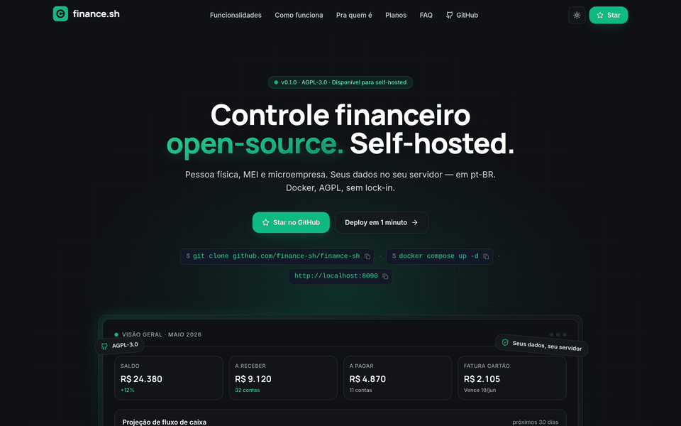

*Tour de 8 telas — capturado em uma instância real com `SEED=true` (Mai 2026).*

</div>

### Galeria

<table>
<tr>
<td width="33%" align="center">
  <a href="docs/screenshots/02-dashboard.png">
    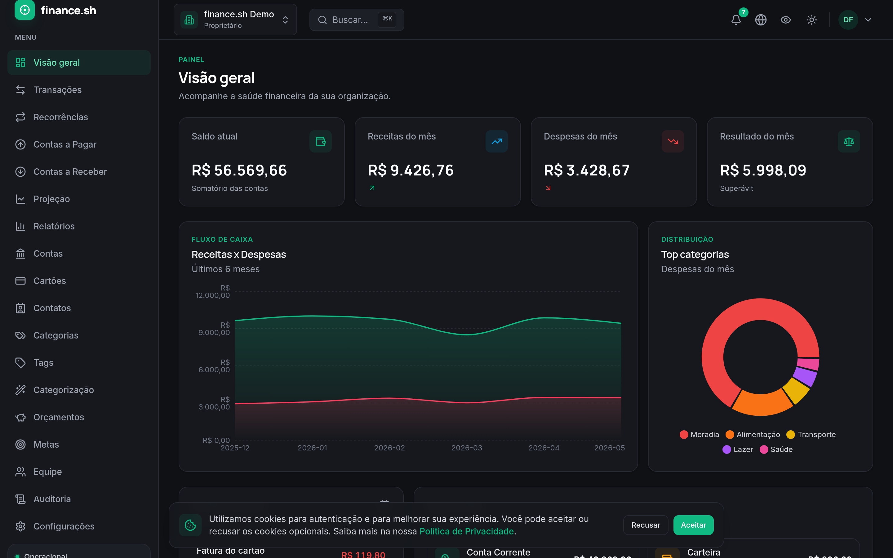
  </a>
  <br/><sub><b>Dashboard</b> — saldo, fluxo de caixa, top categorias.</sub>
</td>
<td width="33%" align="center">
  <a href="docs/screenshots/03-transactions.png">
    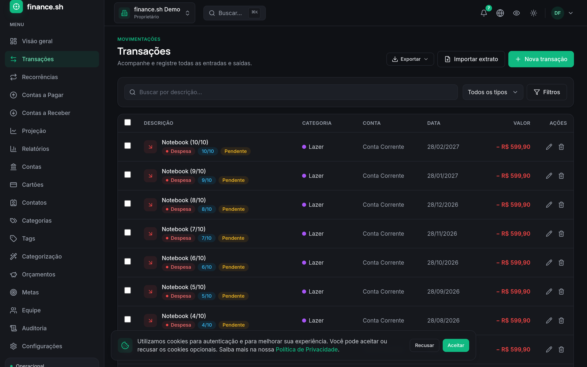
  </a>
  <br/><sub><b>Transações</b> — lista filtrável + tags + busca.</sub>
</td>
<td width="33%" align="center">
  <a href="docs/screenshots/05-cartoes-faturas.png">
    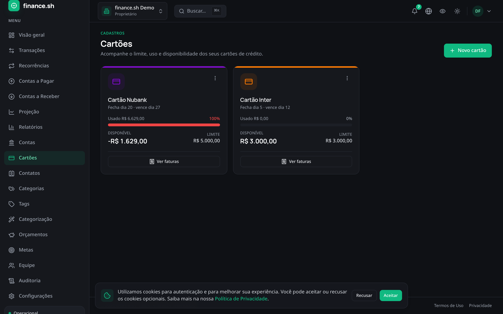
  </a>
  <br/><sub><b>Cartões</b> — limite, uso, ciclo de faturas.</sub>
</td>
</tr>
<tr>
<td width="33%" align="center">
  <a href="docs/screenshots/06-relatorios.png">
    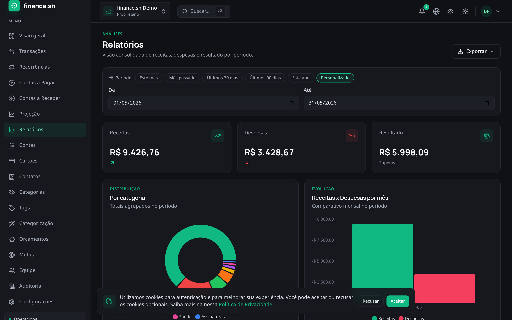
  </a>
  <br/><sub><b>Relatórios</b> — exportação Excel/PDF/CSV.</sub>
</td>
<td width="33%" align="center">
  <a href="docs/screenshots/10-projecao-fluxo.png">
    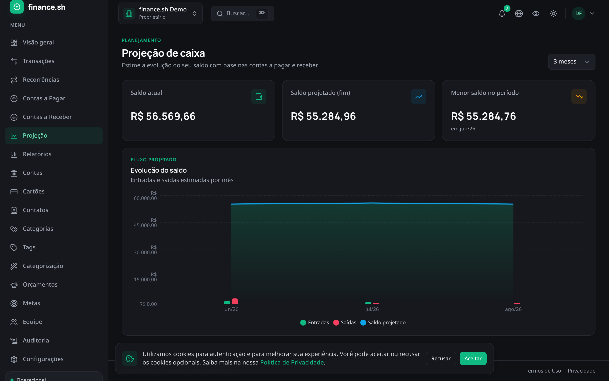
  </a>
  <br/><sub><b>Projeção</b> — fluxo de caixa N meses à frente.</sub>
</td>
<td width="33%" align="center">
  <a href="docs/screenshots/11-orcamentos.png">
    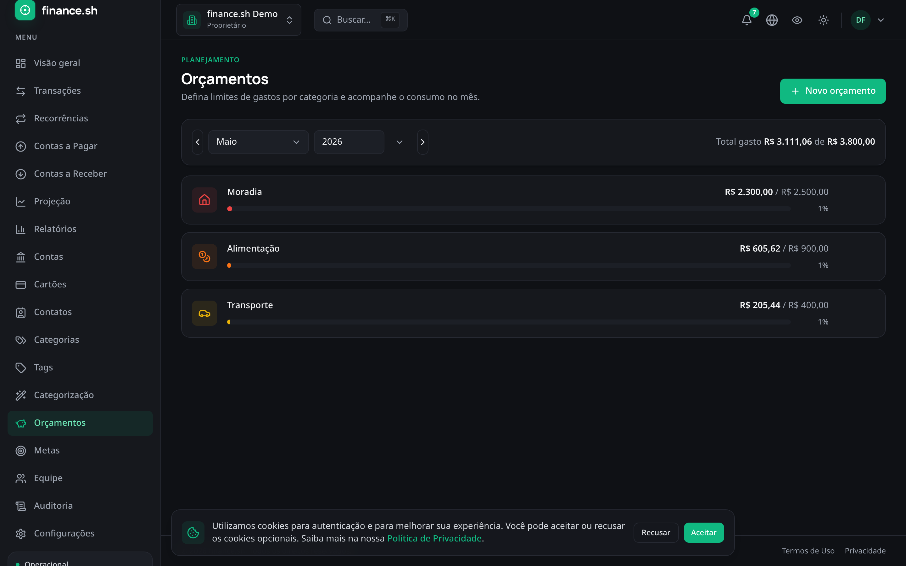
  </a>
  <br/><sub><b>Orçamentos</b> — meta mensal por categoria.</sub>
</td>
</tr>
<tr>
<td width="33%" align="center">
  <a href="docs/screenshots/12-contas-a-pagar.png">
    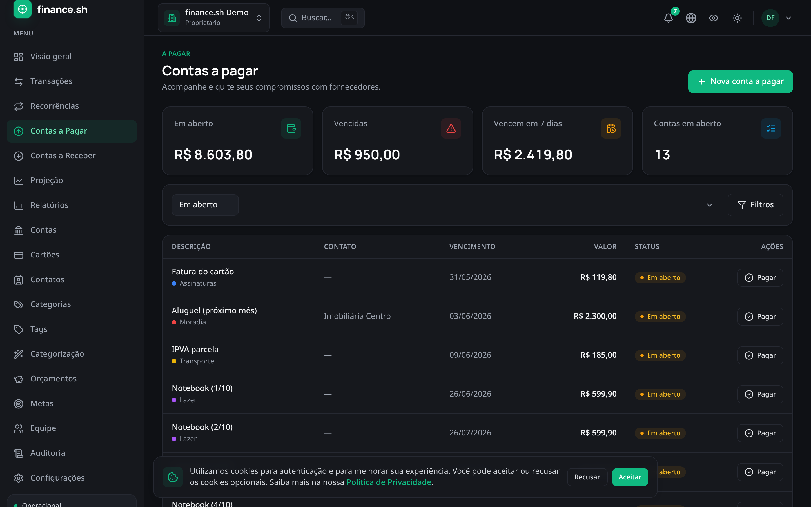
  </a>
  <br/><sub><b>Contas a pagar</b> — vencimentos e baixa.</sub>
</td>
<td width="33%" align="center">
  <a href="docs/screenshots/13-recorrencias.png">
    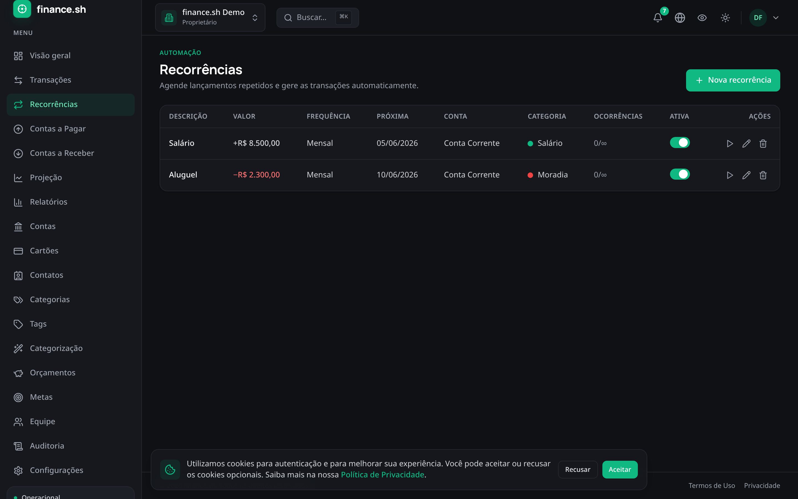
  </a>
  <br/><sub><b>Recorrências</b> — regras, scheduler in-process gera ocorrências.</sub>
</td>
<td width="33%" align="center">
  <a href="docs/screenshots/07-settings-edition.png">
    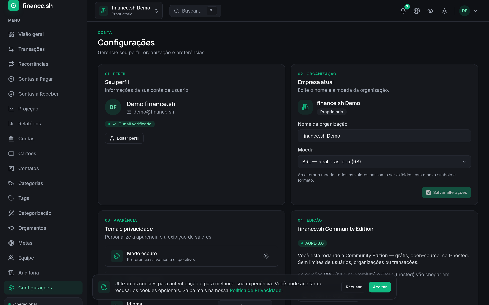
  </a>
  <br/><sub><b>Configurações</b> — open-source AGPL-3.0, sem limites.</sub>
</td>
</tr>
<tr>
<td width="33%" align="center">
  <a href="docs/screenshots/08-admin.png">
    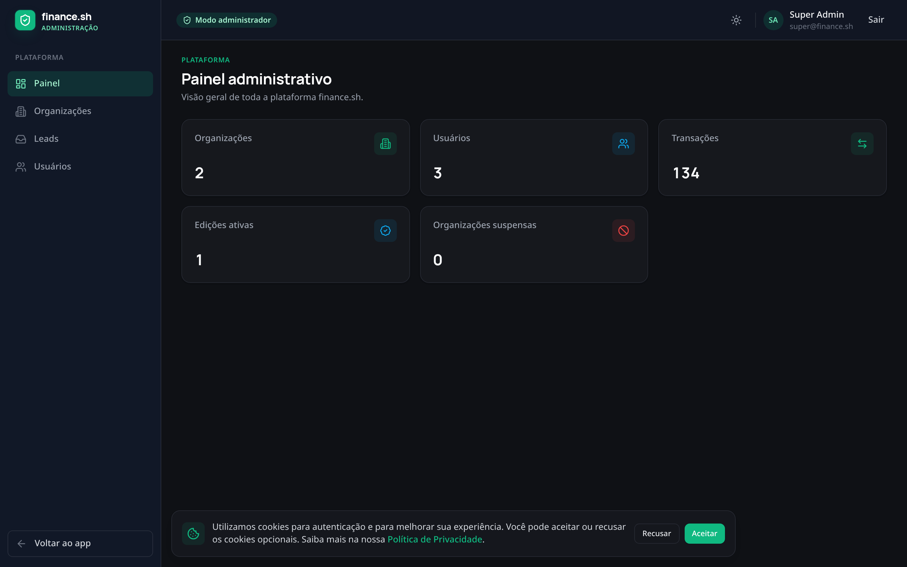
  </a>
  <br/><sub><b>Painel administrativo</b> — visão da plataforma.</sub>
</td>
<td width="33%" align="center">
  <a href="docs/screenshots/00-landing.png">
    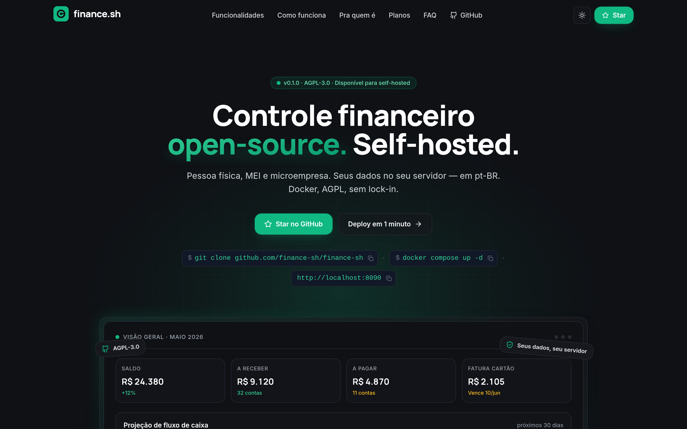
  </a>
  <br/><sub><b>Landing</b> — página de marketing (deploy externo).</sub>
</td>
<td width="33%" align="center">
  <a href="docs/screenshots/09-mobile-dashboard.png">
    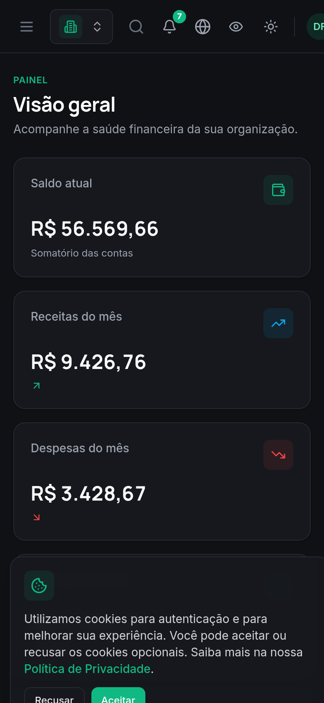
  </a>
  <br/><sub><b>Mobile / PWA</b> — instalável no celular.</sub>
</td>
</tr>
</table>

> Quer ver ao vivo? `docker compose up -d` e acesse <http://localhost:8090> com `demo@finance.sh` / `senha123` (após `SEED=true`).

---

## Arquitetura

Topologia de implantação e camadas de Clean Architecture do backend:

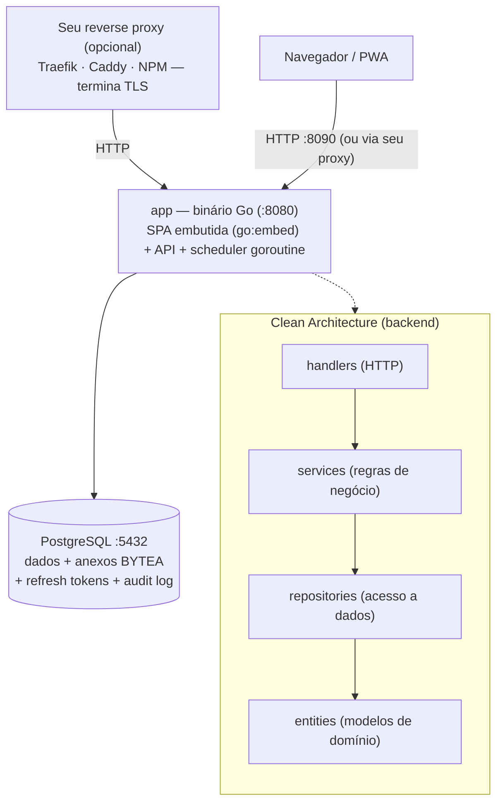

Fluxo: um **único binário Go** serve a SPA (embutida via `go:embed`) em `/` e a API em `/api/` — mesma origem, sem CORS, sem container web separado. Publica **HTTP puro** numa porta; **TLS é responsabilidade do seu reverse proxy** (Traefik/Caddy/Nginx Proxy Manager), padrão do nicho self-hosted (Vaultwarden/Miniflux-style). O backend aplica middlewares (rate limit in-memory, auth, tenant) e delega pros **handlers**, que chamam **services**, que usam **repositories** pra acessar Postgres. Regras de domínio nos **services**; **entities** não conhecem HTTP nem banco. O **scheduler** (recorrência, notificações, purga LGPD) roda como **goroutine in-process**. **Postgres é a única dependência externa** — anexos viram BYTEA, lockout/refresh ficam no DB, rate limit/cache são in-memory.

Detalhes: [`docs/ARCHITECTURE.md`](docs/ARCHITECTURE.md).

---

## Stack tecnológica

| Camada | Tecnologias |
|---|---|
| **Backend** | Go 1.22 · [chi](https://github.com/go-chi/chi) · [GORM](https://gorm.io) · PostgreSQL 16 · JWT (golang-jwt) · bcrypt · golang-migrate · pquerna/otp (2FA) · excelize + go-pdf/fpdf (export) · `golang.org/x/time/rate` (rate limit in-memory) · scheduler goroutine in-process |
| **Frontend** | React 18 · TypeScript · Vite 6 · Tailwind CSS · React Query (TanStack) · Zustand · Axios · Recharts · React Router · React Hook Form + Zod · react-i18next · vite-plugin-pwa |
| **Infra** | Docker · Docker Compose · SPA embutida no binário Go (`go:embed`, multi-stage build) · traga seu reverse proxy p/ TLS · GitHub Actions (CI + scans Trivy/gosec/govulncheck/gitleaks) |

> A **landing page** (site de marketing) mora em **repositório/deploy separado** (Vercel/Netlify/Cloudflare Pages) e não faz parte deste stack. A SPA linka pra ela via `VITE_LANDING_URL` quando setado.

---

## Estrutura do repositório

```
finance-sh/
├── backend/                 # App Go (módulo github.com/finance-sh/finance-sh)
│   ├── cmd/api/             # entrypoint único: API + SPA embutida + scheduler in-process
│   ├── internal/
│   │   ├── config/          # carga de configuração via env
│   │   ├── database/        # conexão, migrations, seed
│   │   ├── dto/             # data transfer objects
│   │   ├── entities/        # modelos de domínio (GORM)
│   │   ├── handlers/        # camada HTTP + router
│   │   ├── middlewares/     # security headers, auth, tenant, CORS, rate limit
│   │   ├── repositories/    # acesso a dados
│   │   ├── services/        # regras de negócio
│   │   └── web/             # SPA embutida (go:embed) + handler de servir estático
│   ├── pkg/                 # libs reutilizáveis (crypto, hash, jwt, logger, response, validator, totp, lockout)
│   ├── docs/openapi.yaml    # API spec escrita à mão
│   └── Dockerfile           # imagem ÚNICA da app: builda a SPA + embute no binário Go (context = raiz)
├── frontend/                # SPA React + Vite (buildada e embutida em backend/Dockerfile)
│   ├── src/
│   └── public/
├── scripts/
│   ├── backup.sh            # pg_dump cifrado (GPG AES-256) + retenção
│   └── restore.sh           # restauração do dump cifrado
├── docs/
│   ├── ARCHITECTURE.md      # arquitetura detalhada (pt-BR)
│   ├── SECURITY.md          # modelo de ameaças e controles
│   └── LGPD.md              # conformidade LGPD (ROPA, direitos, incidentes)
├── .github/
│   ├── ISSUE_TEMPLATE/      # bug report + feature request + config
│   ├── PULL_REQUEST_TEMPLATE.md
│   └── workflows/ci.yml     # pipeline de CI
├── docker-compose.yml       # orquestração completa (endurecida)
├── .env.example             # variáveis de ambiente documentadas
├── Makefile                 # atalhos de desenvolvimento
├── LICENSE                  # AGPL-3.0
├── CODE_OF_CONDUCT.md       # Contributor Covenant 2.1 (EN + pt-BR)
├── CONTRIBUTING.md          # guia de contribuição
└── README.md
```

---

## Início rápido

**Pré-requisitos:** Docker 24+ e Docker Compose v2.

```bash
# 1. Clone
git clone https://github.com/finance-sh/finance-sh && cd finance-sh

# 2. Crie o .env (defaults de dev funcionam de cara)
cp .env.example .env

# 3. Suba a stack inteira
docker compose up -d --build
```

Após subir (~1 min no primeiro build), **2 containers** default ficam ativos:

| Container | Função |
|---|---|
| `finance-sh-postgres` | PostgreSQL 16 |
| `finance-sh-app` | Binário Go: SPA embutida (`go:embed`) + API + scheduler in-process, em uma porta HTTP |

Para inspecionar o banco em dev, use `docker exec finance-sh-postgres psql -U finance_sh` ou conecte um cliente local (DBeaver, TablePlus, IDE) em `127.0.0.1:5433`.

> **TLS não vem embutido** — a app publica HTTP puro; você usa seu próprio reverse proxy (ver [Reverse proxy](#reverse-proxy) abaixo).

URLs (portas de host deslocadas pra não conflitar):

| Serviço | URL | Observação |
|---|---|---|
| **App (SPA + API)** | **http://127.0.0.1:8090** | Entrada principal (HTTP puro). Em produção fica atrás do seu proxy com TLS. |
| Swagger UI | http://127.0.0.1:8090/swagger | Só em dev (mesma porta da app). |
| PostgreSQL | `127.0.0.1:5433` | Loopback only. |

Pra popular dados de demonstração, mantenha `SEED=true` no `.env` (já é o padrão) ou rode `make seed`.

---

## Desenvolvimento local sem Docker

Sobe só a infra via Compose, roda os apps na máquina (loop rápido):

```bash
docker compose up -d postgres                # única dependência
make backend-dev                             # cd backend && go run ./cmd/api  (:8090)
make frontend-dev                            # cd frontend && npm run dev      (:5173)
```

Vite (`5173`) faz proxy de `/api` pra `http://localhost:8090`. Postgres em `5433` no host. Em dev você usa o Vite dev server (HMR); o binário Go só serve a SPA embutida nos builds Docker/produção.

---

## Primeiro acesso (setup wizard)

No **primeiro acesso com banco vazio**, a app mostra o **setup wizard**: um formulário onde **você cria** o primeiro super-admin (nome, e-mail, senha) e a organização. Nenhum segredo é exibido — você define a senha. É o padrão (`BOOTSTRAP_ADMIN=false`, default), seguro pra acesso web.

1. Suba a stack e abra **http://127.0.0.1:8090**.
2. Banco vazio → cai automaticamente em **/setup**.
3. Preencha admin + organização → pronto, já entra logado.

Protegido server-side por `users-count == 0` em transação (só roda uma vez; ninguém recria o admin depois).

> **Não há "admin separado".** O usuário que você cria no wizard **já é o admin**: é o **super-admin da plataforma** (acessa o back-office `/admin`) **e** o **dono (owner)** da primeira organização. Uma conta só, com as duas capacidades. As contas `super@finance.sh` / `admin@finance.sh` que aparecem por aí são apenas **seed de dev** (`SEED=true`) e **bootstrap headless** (`BOOTSTRAP_ADMIN=true`) — não existem no deploy real.

### Deploy headless (sem UI) — opt-in

Pra automação/CI sem navegador, `BOOTSTRAP_ADMIN=true`: a app cria o admin no boot e, se `ADMIN_PASSWORD` estiver vazio, **gera uma senha e imprime no log**:

```
┌────────────────────────────────────────────────────────────┐
│ ADMIN CRIADO — troque a senha no 1º login                    │
│   email:  admin@finance.sh                                   │
│   senha:  7Kq9-mZ2x-Vp4w-Rt6n  (aleatória)                   │
└────────────────────────────────────────────────────────────┘
```

> A senha sai em `docker compose logs app`. Use esse modo só onde você controla quem lê o log (não exponha a porta antes do 1º login).

### Credenciais de demonstração (dev)

Com `SEED=true` (default em dev), o backend também cria usuários de exemplo (nesse caso o admin automático é pulado, pois já existem usuários):

| Tipo | E-mail | Senha |
|---|---|---|
| Usuário comum (org demo) | `demo@finance.sh` | `senha123` |
| Super-admin (admin da plataforma) | `super@finance.sh` | `superadmin123` |

**Troque as senhas no primeiro login.** O fluxo de "trocar senha" está habilitado por padrão.

> Isso é **só dado de desenvolvimento**. Num deploy real (`SEED=false`) existe apenas o usuário que você cria no wizard — que já é o admin.

---

## Esqueci a senha (sem SMTP)

Self-hosted normalmente roda **sem SMTP** configurado. Há 3 caminhos pra recuperar acesso:

1. **CLI (operador com shell) — recomendado.** Reseta a senha de qualquer usuário direto do servidor, estilo Coolify/Miniflux/`occ`:

   ```bash
   docker compose run --rm app -reset-password admin@finance.sh
   ```

   Gera uma senha aleatória, **imprime no terminal**, força a troca no próximo login e revoga as sessões ativas. Ideal pro caso "sou o único usuário e esqueci a senha".

2. **Link no log.** O fluxo `/forgot-password` da UI gera um token; **sem SMTP, o link `…/reset-password?token=…` é escrito no log**. Pegue em `docker compose logs app` e abra no navegador.

3. **Super-admin.** No back-office `/admin` → Usuários → resetar a senha de outro usuário (força troca no próximo login).

> Com SMTP configurado (`SMTP_*`), o `/forgot-password` envia o link por e-mail normalmente.

---

## Variáveis de ambiente

Todas em [`.env.example`](.env.example). Resumo:

| Variável | Padrão (dev) | Descrição |
|---|---|---|
| `APP_ENV` | `development` | `development` / `production`. |
| `APP_PORT` | `8090` | Porta HTTP da app: listen local (`make backend-dev`) e porta de host publicada (docker). Interno no container: `8080`. |
| `SWAGGER_ENABLED` | `true` | Expor Swagger UI. **`false` em produção.** |
| `FRONTEND_URL` | `http://localhost:8090` | URL pública da SPA (links de e-mail, CORS). |
| `BOOTSTRAP_ADMIN` | `false` | `false` = setup wizard no 1º acesso (você cria o admin pela web). `true` = cria admin no boot e loga a senha (deploy headless). |
| `ADMIN_EMAIL` | `admin@finance.sh` | E-mail do admin criado no 1º boot. |
| `ADMIN_PASSWORD` | _(vazio)_ | Senha do admin. Vazio = gera aleatória e loga no boot. Sempre forçada a trocar no 1º login. |
| `ADMIN_ORG_NAME` | `Minha Organização` | Nome da organização criada com o admin. |
| `ENCRYPTION_KEY` | _(base64 32B)_ | Chave AES-256 pra cifrar PII/2FA. **Trocar em produção:** `openssl rand -base64 32`. |
| `DB_HOST` | `postgres` (compose) | Host do PostgreSQL. |
| `DB_PORT` | `5433` | Porta no host. Interno: `5432`. |
| `DB_USER` / `DB_PASSWORD` / `DB_NAME` | `finance_sh` | Credenciais/banco. **Trocar em produção.** |
| `DB_SSLMODE` | `prefer` | Dev: `prefer`. Prod: `require`/`verify-full`. |
| `JWT_ACCESS_SECRET` / `JWT_REFRESH_SECRET` | `dev-...` | **Trocar em produção.** |
| `JWT_ACCESS_TTL_MIN` / `JWT_REFRESH_TTL_DAYS` | `15` / `7` | TTLs dos tokens. |
| `LOGIN_MAX_ATTEMPTS` / `LOGIN_LOCKOUT_MIN` | `5` / `15` | Brute-force lockout. |
| `SMTP_*` | _(vazio)_ | Sem SMTP → backend loga e-mails no stdout. |
| `CORS_ORIGINS` | `http://localhost:8090,http://localhost:5173` | Origens permitidas (CSV). Same-origin em prod; relevante só pro Vite dev. |
| `RATE_LIMIT_RPM` | `120` | Limite de requisições por minuto por IP (token bucket in-memory, por processo). |
| `RETENTION_DAYS` | `90` | Dias até purga de dados expirados/excluídos (LGPD). |
| `TERMS_VERSION` | `1.0` | Versão dos Termos/Privacidade (consentimento versionado). |
| `SEED` | `true` | Popular dados demo no boot. |
| `JOBS_IN_PROCESS` | `true` | Scheduler como goroutine in-process na app. `false` desliga o scheduler (ex.: múltiplas réplicas onde só uma agenda). |
| `WORKER_INTERVAL_SEC` | `3600` | Intervalo do loop do scheduler (segundos). |
| `VITE_API_URL` | `/api/v1` | Base da API usada pela SPA. |
| `VITE_LANDING_URL` | _(vazio)_ | URL da landing pública pra link na tela de login. Vazio = link escondido. Setar pra `https://finance.sh` (ou domínio próprio do deploy externo). |

---

## Multi-organização

finance.sh suporta múltiplas **organizações** dentro do mesmo deploy (família, pessoal + PJ, sócios, contadores). Toda entidade financeira carrega um `organization_id` e **todas as queries são escopadas** por ele.

**Criar outra organização:** logado, vá em **Configurações → Nova organização** (ex.: uma "Casa" e uma "Microempresa"). Você vira owner da nova org, que já nasce com categorias/contas padrão. Troque entre elas pelo **seletor de organização** no topo. Cada org tem dados totalmente isolados.

O tenant ativo é informado pelo cabeçalho HTTP **`X-Organization-ID`**. O middleware de tenant valida que o usuário autenticado possui uma `Membership` naquela organização (e qual o papel/role) antes de qualquer acesso a dados.

```
Authorization: Bearer <access-token>
X-Organization-ID: <uuid-da-organização>
```

Veja modelo de dados e padrão de query escopada em [`docs/ARCHITECTURE.md`](docs/ARCHITECTURE.md).

> **Self-hosted por design.** O isolamento entre organizações é lógico (via `organization_id`), suficiente para o uso self-hosted (família, sócios, contadores na mesma instância).

### Portabilidade (exportar / importar)

- **Exportar:** Configurações → exporta todos os seus dados (contas, categorias, transações, etc.) em **JSON/CSV/PDF/Excel** (LGPD art. 18 — sem lock-in).
- **Importar:** Configurações → **Importar dados** → envie um JSON de export. Ele é restaurado numa **organização nova** (com remapeamento de IDs), ideal pra **migrar entre instâncias** ou montar um ambiente do zero a partir de um export.

---

## Reverse proxy

A app publica **HTTP puro** em `APP_PORT` (default `8090`) e **não embute TLS** — de propósito. No nicho self-hosted/homelab você quase sempre já tem um reverse proxy fazendo Let's Encrypt; basta apontá-lo pra app. Mesmo modelo de Vaultwarden, Miniflux e Paperless-ngx.

Se o proxy roda **no mesmo host**, prefira fixar a porta em loopback no `docker-compose.yml` (`"127.0.0.1:${APP_PORT:-8090}:8080"`) pra app não ficar exposta direto.

**Caddy** (TLS automático, `Caddyfile`):

```caddy
finance.example.com {
    reverse_proxy 127.0.0.1:8090
}
```

**Traefik** (labels no compose; junte a app à rede do Traefik):

```yaml
labels:
  - "traefik.enable=true"
  - "traefik.http.routers.finance.rule=Host(`finance.example.com`)"
  - "traefik.http.routers.finance.tls.certresolver=le"
  - "traefik.http.services.finance.loadbalancer.server.port=8080"
```

**Nginx Proxy Manager:** crie um Proxy Host → Forward Hostname/IP = host da app, Port = `8090`, marque *Websockets* e peça certificado Let's Encrypt na aba SSL.

**Nginx manual:**

```nginx
server {
    server_name finance.example.com;
    listen 443 ssl;        # certs via certbot
    location / {
        proxy_pass http://127.0.0.1:8090;
        proxy_set_header Host $host;
        proxy_set_header X-Forwarded-For $proxy_add_x_forwarded_for;
        proxy_set_header X-Forwarded-Proto $scheme;
    }
}
```

Defina `FRONTEND_URL` com a URL pública (ex.: `https://finance.example.com`) pra links de e-mail saírem corretos.

---

## Segurança & LGPD

Documentos dedicados:
- [`docs/SECURITY.md`](docs/SECURITY.md) — modelo de ameaças, controles, gestão de segredos.
- [`docs/LGPD.md`](docs/LGPD.md) — bases legais, ROPA, direitos do titular, retenção, incidentes.

Controles já implementados:

- **TLS terminado no seu reverse proxy** (não embutido — ver [Reverse proxy](#reverse-proxy)); a app respeita `X-Forwarded-Proto`/`Host`.
- **Cabeçalhos de segurança** e **CSP** (X-Frame-Options DENY, nosniff, Referrer-Policy, Permissions-Policy).
- **JWT** access/refresh com refresh **rotacionado** e guardado como **hash**.
- Senhas com **bcrypt**; **lockout** de brute-force.
- **RBAC** + **isolamento por organization_id**.
- **Rate limiting** e **CORS** restrito.
- **Criptografia de campo** AES-256-GCM via `ENCRYPTION_KEY` para PII/segredo 2FA.
- **Log de auditoria**, **soft delete** e **purga por retenção** (`RETENTION_DAYS`).
- **Isolamento de rede**: rede de dados `internal` (postgres sem rota externa); porta do Postgres em `127.0.0.1`; app atrás do seu proxy (fixe em loopback se o proxy é local).
- **Endurecimento de container**: non-root, `no-new-privileges`, `cap_drop: ALL`, rootfs `read_only` + `tmpfs`, limites de memória/PIDs e rotação de logs.
- **CI de segurança**: govulncheck, gosec, npm audit, gitleaks, trivy.
- Valores monetários sempre em **centavos** (`int64`).

**LGPD self-hosted:** como você hospeda no seu próprio servidor, **você é o controlador** dos dados na sua instância. Não há terceiro processando. As ferramentas (export, exclusão, audit log, consentimento versionado) cumprem os direitos do titular (LGPD art. 18). Detalhes em [`docs/LGPD.md`](docs/LGPD.md).

---

## Backups criptografados

```bash
export BACKUP_PASSPHRASE='uma-passphrase-forte'   # fora do histórico do shell
make backup                                       # gera backups/finance_sh-...sql.gpg (GPG AES-256)
make restore FILE=backups/finance_sh-AAAAMMDD-HHMMSS.sql.gpg
```

Dumps cifrados com **GPG AES-256** e podados por `RETENTION_DAYS`. Guarde o diretório de backups e o volume `pgdata` em **disco criptografado** (LUKS / volume cloud criptografado) — cobre criptografia em repouso do que não é cifrado em campo.

### ⚠️ Faça backup da `ENCRYPTION_KEY` (crítico)

Campos sensíveis (notas de transação, segredo do 2FA) são cifrados em repouso com a `ENCRYPTION_KEY`. **Ela NÃO está dentro do dump do banco** — é a chave que decifra esses campos. Se você **perder a chave**, esses dados ficam **permanentemente ilegíveis**, mesmo com o backup do Postgres intacto.

- **Guarde a `ENCRYPTION_KEY` separada do banco**, num gerenciador de segredos (Bitwarden/Vault/1Password) ou cofre offline. Tratar como a senha mestra.
- **Nunca commite** a chave (o `.env` é gitignored de propósito).
- **Não troque a chave** depois de ter dados cifrados — trocar = perder o que já foi cifrado (não há rotação automática nesta versão).
- Gere uma única e forte: `openssl rand -base64 32`. Em produção o app **se recusa a subir** com a chave de exemplo/dev.

> Regra prática: **2 segredos pra guardar fora do servidor** — a `ENCRYPTION_KEY` (decifra os campos) e a `BACKUP_PASSPHRASE` (abre os dumps). Perdeu qualquer uma → perdeu o respectivo dado.

---

## Roadmap

### v0.1 — Foundation (atual)
- ✅ Auth (JWT + 2FA TOTP + lockout + verify email)
- ✅ RBAC + multi-organização + audit log + soft delete
- ✅ Contas, transações, categorias, contatos
- ✅ Cartões + faturas + parcelamento
- ✅ Contas a pagar/receber
- ✅ Orçamentos + metas
- ✅ Recorrência via scheduler in-process
- ✅ Multi-moeda (15 ISO-4217)
- ✅ Anexos (BYTEA em Postgres)
- ✅ Import OFX/CSV + dedup
- ✅ Busca global + tags + categorização automática
- ✅ Dashboard + projeção fluxo + relatórios (Excel/PDF/CSV)
- ✅ PWA + i18n pt-BR/en/es + modo privacidade + dark mode
- ✅ Crypto AES-GCM + LGPD UI

### v0.2 — Polish (próximo)
- [ ] Setup wizard primeiro login (cria admin se DB vazio, define moeda, primeira org)
- [ ] CHANGELOG.md automático
- [ ] CI publicando a imagem em `ghcr.io/finance-sh/finance-sh-app`
- [ ] Documentação completa em `docs/` (deploy guides: Portainer, Coolify, Synology, Unraid)
- [ ] Helm chart pra Kubernetes
- [ ] One-click deploy: Railway, Render, Fly.io
- [ ] Screenshots + GIF demo no README

### v1.0 — Estável
- [ ] API estável + versionada
- [ ] Telemetria opt-in anônima (estilo Plausible/Matomo)
- [ ] Open Finance Brasil (Pluggy/Belvo)
- [ ] OCR de comprovantes
- [ ] App mobile nativo

### Backlog
- [ ] WebSockets/push pra notificações em tempo real
- [ ] OAuth (Google, GitHub, login social)
- [ ] Filas dedicadas (RabbitMQ/NATS) se necessário

Sugira features abrindo [issue de feature request](.github/ISSUE_TEMPLATE/feature_request.yml) ou [Discussion](https://github.com/finance-sh/finance-sh/discussions).

---

## Contribuindo

Pull requests bem-vindos. Veja:

- [`CONTRIBUTING.md`](CONTRIBUTING.md) — setup, padrões de código, fluxo de PR, DCO, i18n
- [`CODE_OF_CONDUCT.md`](CODE_OF_CONDUCT.md) — Contributor Covenant 2.1 (EN + pt-BR)
- [Issues](https://github.com/finance-sh/finance-sh/issues) — bugs e features
- [Discussions](https://github.com/finance-sh/finance-sh/discussions) — perguntas e ideias

**Antes de PR grande:** abra Discussion ou issue de proposta. Economiza retrabalho.

---

## Licença

Distribuído sob **GNU Affero General Public License v3.0 (AGPL-3.0)**. Veja [`LICENSE`](LICENSE).

Resumo das implicações:

- Você **pode** usar, modificar e redistribuir o código.
- Se você **hospedar publicamente** uma versão modificada (mesmo via rede), precisa **disponibilizar o código-fonte modificado** pra quem usa o serviço.
- Forks privados de uso interno são permitidos.
- Sua contribuição é licenciada sob AGPL-3.0 ao abrir PR (veja [DCO em CONTRIBUTING.md](CONTRIBUTING.md#licença-e-dco)).

---

<div align="center">

**finance.sh** · feito no Brasil 🇧🇷 · AGPL-3.0

[Documentação](docs/) · [Contribuir](CONTRIBUTING.md) · [Issues](https://github.com/finance-sh/finance-sh/issues) · [Discussions](https://github.com/finance-sh/finance-sh/discussions)

</div>
