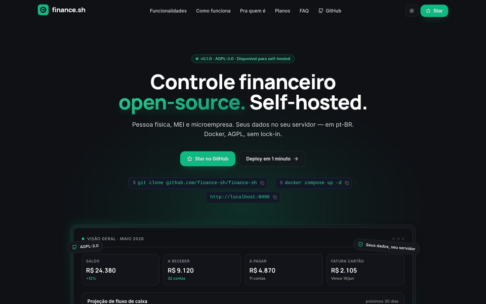

<div align="center">

# finance.sh

**Controle financeiro open-source e self-hosted, feito no Brasil.**
Para pessoa física, MEI e microempresa. Seus dados ficam no seu servidor.

[](https://go.dev)
[](https://react.dev)
[](https://www.docker.com)
[](LICENSE)
[](CONTRIBUTING.md)



</div>

## Por que finance.sh

Mobills, Organizze e Conta Azul guardam seus extratos na nuvem de outra
empresa, atrás de uma assinatura. O finance.sh faz o mesmo trabalho no seu
próprio servidor:

- 🏠 **Seu servidor, seus dados.** Roda num desktop, NAS, Raspberry Pi, VPS ou homelab. Sem telemetria e sem terceiros.
- 🇧🇷 **Brasileiro de fato.** pt-BR, BRL, MEI e microempresa como casos de primeira classe, e extratos OFX/CSV dos bancos daqui.
- 🔓 **Sem lock-in.** Exporte tudo em OFX, CSV, JSON, PDF ou Excel quando quiser. Código aberto sob AGPL-3.0.
- 🐳 **Sobe em 1 minuto.** Dois containers (app + Postgres), um `docker compose up` e pronto.

## O que ele faz

| | |
|---|---|
| 💳 **Contas e cartões** | Contas, cartões com faturas e parcelamento, transferências, contas a pagar e a receber |
| 📊 **Análise** | Dashboard, projeção de fluxo de caixa, orçamentos, metas e relatórios em Excel/PDF/CSV |
| 🔁 **Automação** | Recorrências, importação de extratos OFX/CSV com dedup e categorização automática |
| 👥 **Multi-organização** | Pessoal, família e empresa na mesma instância, com papéis e convites |
| 🔐 **Segurança** | 2FA, criptografia de campo, audit log e ferramentas de LGPD (exportar e excluir conta) |
| 📱 **Em qualquer tela** | PWA instalável, modo escuro, modo privacidade e interface em pt-BR, en e es |

Lista completa em [**Funcionalidades**](docs/FUNCIONALIDADES.md).

<table>
<tr>
<td width="33%" align="center"><br/><sub><b>Dashboard</b></sub></td>
<td width="33%" align="center"><br/><sub><b>Cartões e faturas</b></sub></td>
<td width="33%" align="center"><br/><sub><b>Projeção de fluxo</b></sub></td>
</tr>
</table>

Mais telas na [galeria](docs/FUNCIONALIDADES.md#galeria).

## Comece em 3 passos

Pré-requisito: Docker 24+ com Compose v2.

```bash
git clone https://github.com/diego-luz/finance.sh && cd finance.sh
./scripts/gen-env.sh        # cria o .env com segredos próprios desta instalação
docker compose up -d --build
```

Abra **http://localhost:8090** e informe o **código de instalação** que aparece
em `docker compose logs app`. Esse código garante que só quem tem acesso ao
servidor cria o primeiro administrador.

> Guarde a `ENCRYPTION_KEY` do `.env` fora do servidor: sem ela, os campos
> criptografados ficam ilegíveis, mesmo com o backup do banco intacto.

## Documentação

| | |
|---|---|
| 🚀 [**Instalação e operação**](docs/INSTALACAO.md) | Primeiro acesso, desenvolvimento local, proxy reverso com TLS, backup e recuperação de senha |
| ⚙️ [**Configuração**](docs/CONFIGURACAO.md) | Todas as variáveis de ambiente |
| ✨ [**Funcionalidades**](docs/FUNCIONALIDADES.md) | Tudo o que a app faz, multi-organização e galeria de telas |
| 🏗️ [**Arquitetura**](docs/ARCHITECTURE.md) | Visão geral, stack, estrutura do repositório e convenções do código |
| 🔐 [**Segurança**](docs/SECURITY.md) · [**LGPD**](docs/LGPD.md) | Modelo de ameaças, controles, conformidade e direitos do titular |
| 🗺️ [**Roadmap**](docs/ROADMAP.md) | O que já existe e o que vem a seguir |

## Contribuindo

Pull requests são bem-vindos. Leia o [`CONTRIBUTING.md`](CONTRIBUTING.md) e o
[`CODE_OF_CONDUCT.md`](CODE_OF_CONDUCT.md), e abra uma
[issue](https://github.com/diego-luz/finance.sh/issues) antes de uma mudança
grande. Encontrou uma vulnerabilidade? Não abra issue pública: veja como
reportar no [`SECURITY.md`](docs/SECURITY.md).

## Licença

[AGPL-3.0](LICENSE). Você pode usar, modificar e redistribuir. Se oferecer uma
versão modificada como serviço na rede, precisa disponibilizar o código-fonte
dela a quem usa o serviço.

<div align="center">
<sub>Inspirado em <a href="https://www.firefly-iii.org/">Firefly III</a>, <a href="https://actualbudget.org/">Actual Budget</a> e <a href="https://ghost.fo/">Ghostfolio</a> · feito no Brasil 🇧🇷</sub>
</div>
