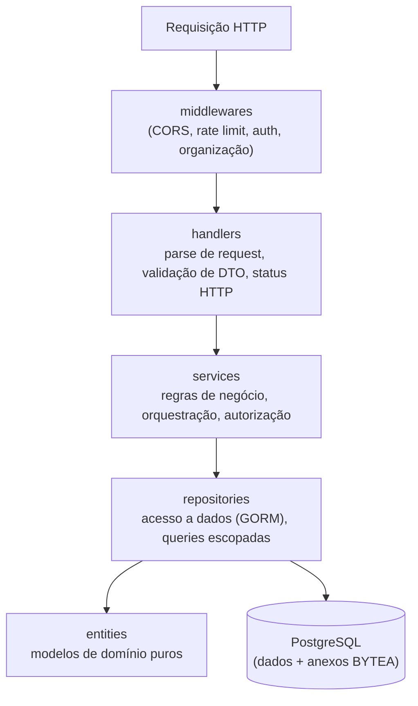
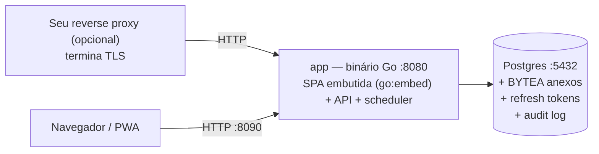
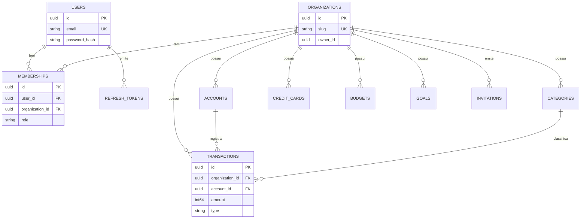
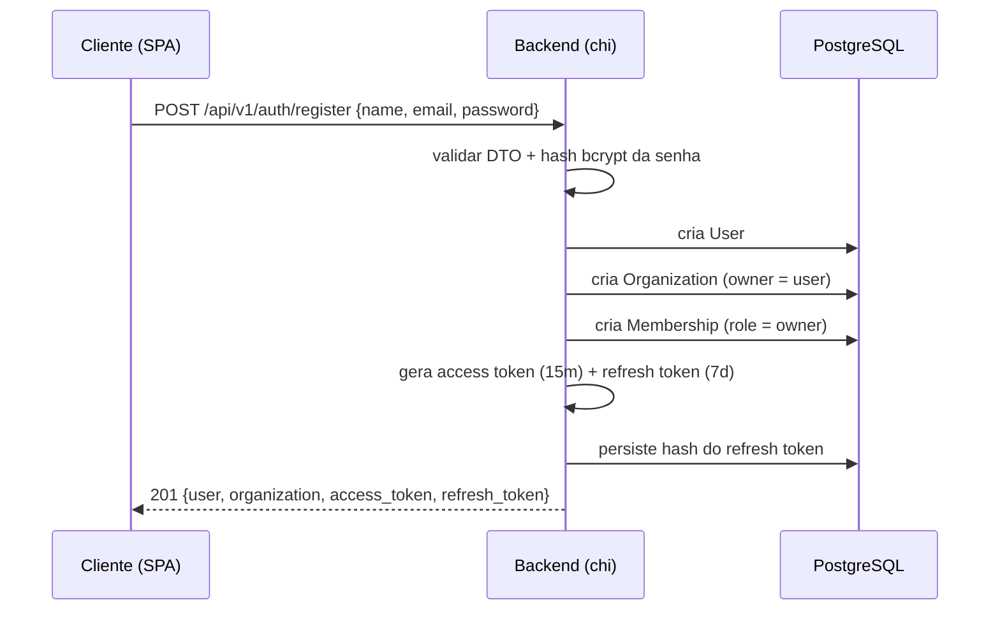
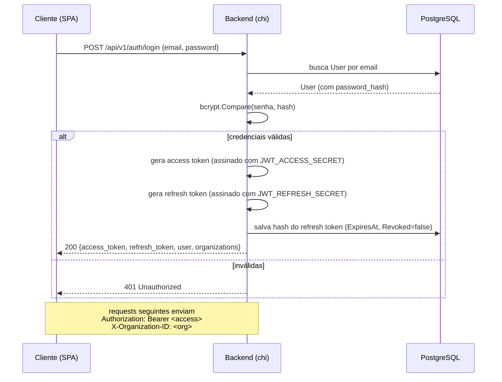
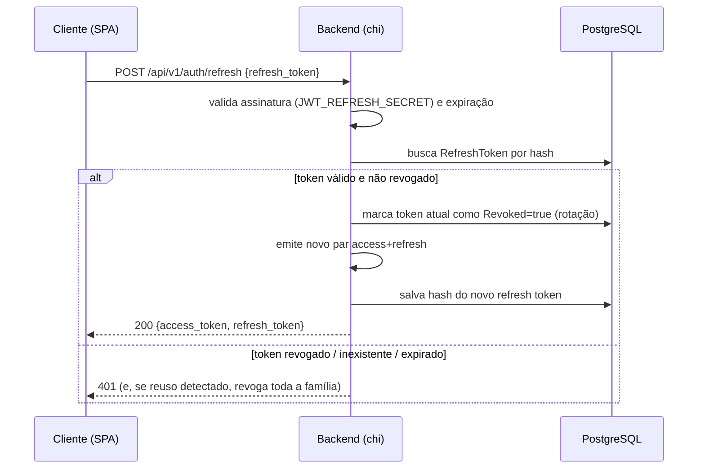

# Arquitetura do finance.sh

Este documento detalha a arquitetura do backend do **finance.sh**
(open-source self-hosted, AGPL-3.0), o modelo de dados
multi-organização, o fluxo de autenticação e as convenções que mantêm o
código consistente e extensível. Texto em pt-BR; identificadores de código
em inglês.

## Sumário

- [Clean Architecture](#clean-architecture)
- [Modelo de dados multi-organização](#modelo-de-dados-multi-organização)
- [RBAC e o padrão de query escopada por organização](#rbac-e-o-padrão-de-query-escopada-por-organização)
- [Fluxo de autenticação](#fluxo-de-autenticação)
- [Convenção de dinheiro em centavos](#convenção-de-dinheiro-em-centavos)
- [Como adicionar um novo módulo](#como-adicionar-um-novo-módulo)

---

## Clean Architecture

O backend segue uma separação em camadas no estilo *Clean Architecture*. A regra
fundamental é a **direção das dependências**: camadas externas dependem das
internas, nunca o contrário. O domínio (`entities`) não conhece HTTP nem banco de
dados.



Responsabilidade de cada camada:

| Camada | Pasta | Responsabilidade | Não faz |
|---|---|---|---|
| **handlers** | `internal/handlers` | Traduzir HTTP ⇄ domínio: ler request, validar DTO, montar resposta e status. | Regras de negócio. |
| **services** | `internal/services` | Regras de negócio, autorização por papel, orquestração de repositórios, transações. | Conhecer `http.Request`/`ResponseWriter`. |
| **repositories** | `internal/repositories` | Persistência via GORM; sempre aplicam o filtro de organização. | Decidir regra de negócio. |
| **entities** | `internal/entities` | Modelos de domínio (tabelas), embutem `Base` (UUID, timestamps, soft delete). | Saber de HTTP/transporte. |

Apoios transversais:

- `internal/config` — carrega configuração de variáveis de ambiente.
- `internal/database` — conexão, AutoMigrate e seed de dados demo.
- `internal/dto` — *data transfer objects* de entrada/saída da API.
- `internal/middlewares` — CORS, rate limit, autenticação JWT e resolução de organização ativa.
- `pkg/` — utilitários reutilizáveis: `hash` (bcrypt), `jwt`, `logger`,
  `response` (envelopes JSON padronizados) e `validator`.

O entrypoint `cmd/api` apenas: carrega config → conecta no Postgres →
(opcionalmente) faz seed → monta o router (`internal/api`) → sobe o **scheduler
in-process** como goroutine (se `JOBS_IN_PROCESS=true`, default) → sobe o servidor
HTTP na porta `8080`, servindo a API sob `/api/v1`, além de `/health` e `/swagger`.



> **Stack default = 2 containers**: `postgres` + `app`. O `app` é um **único
> binário Go** que serve a SPA (embutida via `go:embed`) e a API na **mesma
> porta HTTP** — sem container web dedicado. **TLS não vem embutido**: a app
> publica HTTP puro e você põe seu próprio reverse proxy (Traefik/Caddy/Nginx
> Proxy Manager) na frente. **Única dependência externa: Postgres** — anexos em
> **BYTEA** (TOAST cuida da compressão out-of-line), cache/rate-limit in-memory
> no processo, lockout e refresh tokens no DB. Admin do DB via `psql`
> (`docker exec`) ou cliente local.
> O **scheduler** (recorrência, notificações, purga LGPD) roda como **goroutine
> in-process** dentro da app. Setar
> `JOBS_IN_PROCESS=false` desliga o scheduler (ex.: múltiplas réplicas da app
> onde só uma deve agendar).
>
> A **landing page** (marketing) mora em repositório/deploy **separado**
> (Vercel/Netlify/Cloudflare Pages) — não faz parte deste stack.

## Modelo de dados multi-organização

A separação de dados é por **organização** (`Organization`), que é a fronteira
de isolamento lógico do deploy. Um `User` é uma identidade **global** dentro
da instância; ele se conecta a organizações por meio de `Membership`, e é isso
que permite que a mesma pessoa participe de várias organizações (família,
empresa, sociedade, contador).

> **Multi-organização.** Aqui "multi-org" significa **multi-organização lógica
> dentro do mesmo deploy** do operador — não clientes diferentes compartilhando
> infraestrutura. O isolamento é lógico, por `organization_id`.



Pontos-chave:

- **`User`** — identidade global, e-mail único.
- **`Organization`** — a organização (fronteira de isolamento lógico); tem
  `owner_id`, `slug` único e moeda padrão.
- **`Membership`** — liga usuário a organização com um **papel** (role). Índice único
  composto `(user_id, organization_id)` evita duplicidade.
- Toda entidade financeira (**`Account`**, **`Category`**, **`Transaction`**,
  **`CreditCard`**, **`Budget`**, **`Goal`**, **`Notification`**, **`AuditLog`**) carrega
  **`organization_id`** indexado.
- **`Invitation`** — convite por e-mail antes do convidado ter conta.
- **`RefreshToken`** — guarda o **hash** do refresh token (rotação/revogação).
- Todas embutem `Base`: `id` (UUID), `created_at`, `updated_at` e
  `deleted_at` (soft delete).

## RBAC e o padrão de query escopada por organização

### Papéis (RBAC)

| Papel | Capacidades típicas |
|---|---|
| `owner` | Tudo, incluindo exclusão da organização. |
| `admin` | Gerenciar membros e todos os dados financeiros. |
| `member` | Criar/editar dados financeiros. |
| `viewer` | Somente leitura. |

A autorização por papel é aplicada nos **services** (ou em middleware de
autorização), nunca nos handlers diretamente.

### Organização ativa

O cliente envia a organização ativa no cabeçalho **`X-Organization-ID`**:

```
Authorization: Bearer <access-token>
X-Organization-ID: <uuid-da-organização>
```

O middleware de organização: (1) lê o `user_id` do access token; (2) lê o
`X-Organization-ID`; (3) confirma que existe uma `Membership` ligando os dois;
(4) injeta `organization_id` e `role` no contexto da requisição. Sem membership
válida, a requisição é rejeitada (403).

### Padrão de query escopada

**Toda** consulta de dados de organização filtra por `organization_id`. Esse
filtro vem do contexto (resolvido pelo middleware), nunca de um campo do body —
assim o cliente não consegue forjar acesso a outra organização.

```go
// Repositório: o orgID vem do contexto resolvido pelo middleware de organização.
func (r *transactionRepo) List(ctx context.Context, orgID uuid.UUID) ([]entities.Transaction, error) {
    var txs []entities.Transaction
    err := r.db.WithContext(ctx).
        Where("organization_id = ?", orgID). // <- escopo obrigatório da organização
        Order("date DESC").
        Find(&txs).Error
    return txs, err
}
```

Regra de ouro: **se uma entidade tem `organization_id`, nenhuma query a toca sem o
`WHERE organization_id = ?`.** O soft delete do GORM (`deleted_at`) é aplicado
automaticamente em cima desse filtro.

## Fluxo de autenticação

O finance.sh usa JWT com **access token** de vida curta (15 min por padrão) e **refresh
token** de vida longa (7 dias) com **rotação**: cada uso do refresh invalida o
anterior e emite um novo par. O refresh é guardado como **hash** no banco, então pode
ser revogado server-side (logout, troca de senha, detecção de reuso).

### Primeiro acesso (first-boot)

Numa instância recém-subida o banco não tem usuários. O caminho **padrão e
recomendado** é o **setup wizard**: a SPA consulta `GET /api/v1/setup/status`,
vê `needs_setup=true` e redireciona para `/setup`, onde o operador cria o
primeiro **super-admin + organização** via `POST /api/v1/setup/initialize`. Esse
endpoint é idempotente — a criação roda numa transação com guarda
`count(users) == 0`, então uma 2ª chamada retorna `409`. Nada de segredo é
exibido na UI: o operador escolhe a senha.

Alternativa **headless** para automação/CI (`BOOTSTRAP_ADMIN=true`, default
`false`): a app cria o super-admin no boot e, se `ADMIN_PASSWORD` estiver vazio,
gera uma senha aleatória e a imprime no log. Em ambos os casos o usuário criado
é super-admin **e** owner da primeira organização (não há "admin separado").

### Registro → bootstrap da organização

No registro, além de criar o `User`, o sistema **provisiona automaticamente uma
organização pessoal**: cria a `Organization` (com o usuário como `owner_id`) e
uma `Membership` com papel `owner`. Assim, todo usuário já nasce com uma
organização utilizável.



### Login



### Rotação do refresh token



No **logout**, o backend marca o(s) `RefreshToken` do usuário como `Revoked = true`.

## Convenção de dinheiro em centavos

Todo valor monetário é armazenado como **`int64` em centavos** (a menor unidade da
moeda). Nunca usamos `float`/`double` para dinheiro, evitando erros de arredondamento.

- `R$ 19,90` é persistido como `1990`.
- Campos afetados: `Transaction.Amount`, `Account.InitialBalance`, `Budget.Amount`,
  `Goal.TargetAmount`/`CurrentAmount`, `CreditCard.Limit`.
- `Transaction.Amount` é sempre **positivo**; o sinal vem do campo `Type`
  (`income` soma, `expense` subtrai, `transfer` move entre contas) na hora da
  agregação.
- A formatação para a moeda local (símbolo, separadores) é responsabilidade do
  **frontend**; o backend trafega centavos.

## Como adicionar um novo módulo

Exemplo: adicionar **`Tag`** (etiquetas para transações). Siga as camadas de fora
para dentro, sempre respeitando o escopo de organização.

1. **Entity** — em `internal/entities`, criar `Tag` embutindo `Base` e com
   `OrganizationID uuid.UUID` indexado. Defina `TableName()`.
2. **Migration** — registrar `&entities.Tag{}` no `AutoMigrate` em
   `internal/database`.
3. **DTO** — em `internal/dto`, criar `CreateTagRequest` / `TagResponse` com tags de
   validação.
4. **Repository** — em `internal/repositories`, criar `TagRepository` com métodos que
   **sempre** filtram por `organization_id` (ver [padrão de query escopada](#rbac-e-o-padrão-de-query-escopada-por-organização)).
5. **Service** — em `internal/services`, criar `TagService` com as regras de negócio e
   checagens de papel (RBAC).
6. **Handler** — em `internal/handlers`, criar `TagHandler` (parse + validação de DTO +
   resposta padronizada via `pkg/response`).
7. **Rotas** — registrar as rotas em `internal/api`, sob `/api/v1`, protegidas pelos
   middlewares de auth e organização.
8. **OpenAPI** — documentar os endpoints **à mão** em `backend/docs/openapi.yaml`
   (não há geração automática).
9. **Frontend** — adicionar o serviço de API, hooks de React Query e as telas.

Checklist de revisão para qualquer módulo escopado por organização:

- [ ] A entity tem `organization_id` indexado e embute `Base`.
- [ ] Todas as queries do repositório filtram por `organization_id`.
- [ ] As regras de papel (RBAC) estão no service.
- [ ] Valores monetários são `int64` em centavos.
- [ ] As rotas passam pelos middlewares de auth + organização.
- [ ] O `openapi.yaml` foi atualizado.
