# Funcionalidades — finance.sh

Tudo o que a versão atual faz, com as telas. Para instalar, veja
[`INSTALACAO.md`](INSTALACAO.md).

## Sumário

- [Funcionalidades](#funcionalidades)
- [Multi-organização](#multi-organização)
- [Galeria](#galeria)

---

## Funcionalidades

**Autenticação & segurança**
- **JWT** access + refresh com rotação e detecção de reuso, bcrypt, bloqueio por tentativas (por e-mail e IP).
- **2FA TOTP** com códigos de recuperação; verificação de e-mail.
- **Criptografia de campo** AES-256-GCM das notas dos lançamentos e do segredo do 2FA.
- **LGPD**: consentimento versionado, "exportar meus dados", "excluir conta", PII mascarada em logs.
- **RBAC** granular: `owner`, `admin`, `member`, `viewer`.
- **Audit log** completo na UI de admin; soft delete em todas entidades.
- **Setup wizard** no 1º acesso, protegido por um código de instalação impresso no log do servidor.
- **Recuperar senha sem SMTP**: CLI `-reset-password`, link no log, ou reset por super-admin.

**Multi-organização**
- Mesma instância suporta múltiplas **organizações** (pessoal + PJ + família).
- **Criar novas orgs** pelas Configurações (ex.: Casa + Microempresa) + seletor pra trocar.
- Isolamento total de dados por `organization_id`.
- Convites de membros com escolha de papel.
- **Exportar / importar dados** (export JSON → importa numa org nova; migra entre instâncias).
- Super-admin opcional (read-only) pra ops da plataforma.

**Gestão financeira**
- Contas (banco, carteira, investimento, cartão).
- Transações: receita, despesa, transferência, com **contatos** vinculáveis.
- **Cartões de crédito** com **faturas** (fechamento → vencimento → pagar fatura) e **parcelamento**.
- **Contas a pagar/receber** com baixa (settle) e calendário de vencimentos.
- **Orçamentos** mensais por categoria.
- **Metas** de economia com progresso.
- **Recorrência** com regras (scheduler in-process gera ocorrências).
- **Tags** + **busca global** (⌘K) + **categorização automática** (regras + histórico).
- **Multi-moeda** por organização (15 moedas ISO-4217, BRL default).

**Análise & dados**
- **Dashboard** com gráficos (saldo, fluxo de caixa, gastos por categoria).
- **Projeção de fluxo de caixa** (N meses, alerta de saldo negativo).
- **Relatórios** + export **Excel / PDF / CSV**.
- **Anexos** de comprovante em transações, armazenados como **BYTEA em Postgres** (TOAST cuida da compressão out-of-line). Backup do DB cobre os anexos automaticamente.
- **Import OFX/CSV** de extrato com dedup + categoria sugerida.

**Plataforma**
- **PWA** instalável (offline shell, auto-update).
- **i18n** pt-BR / en / es.
- **Modo privacidade** (oculta valores no dashboard, tipo app de banco).
- **Dark mode** nativo.
- Logs JSON estruturados; OpenAPI escrito à mão; **Swagger UI** opcional em dev.

---

## Multi-organização

finance.sh suporta múltiplas **organizações** dentro do mesmo deploy (família, pessoal + PJ, sócios, contadores). Toda entidade financeira carrega um `organization_id` e **todas as queries são escopadas** por ele.

**Criar outra organização:** logado, vá em **Configurações → Nova organização** (ex.: uma "Casa" e uma "Microempresa"). Você vira owner da nova org, que já nasce com categorias/contas padrão. Troque entre elas pelo **seletor de organização** no topo. Cada org tem dados totalmente isolados.

O tenant ativo é informado pelo cabeçalho HTTP **`X-Organization-ID`**. O middleware de tenant valida que o usuário autenticado possui uma `Membership` naquela organização (e qual o papel/role) antes de qualquer acesso a dados.

```
Authorization: Bearer <access-token>
X-Organization-ID: <uuid-da-organização>
```

Veja modelo de dados e padrão de query escopada em [`ARCHITECTURE.md`](ARCHITECTURE.md).

> **Self-hosted por design.** O isolamento entre organizações é lógico (via `organization_id`), suficiente para o uso self-hosted (família, sócios, contadores na mesma instância).

### Portabilidade (exportar / importar)

- **Exportar:** Configurações → exporta todos os seus dados (contas, categorias, transações, etc.) em **JSON/CSV/PDF/Excel** (LGPD art. 18 — sem lock-in).
- **Importar:** Configurações → **Importar dados** → envie um JSON de export. Ele é restaurado numa **organização nova** (com remapeamento de IDs), ideal pra **migrar entre instâncias** ou montar um ambiente do zero a partir de um export.

---

## Galeria

<table>
<tr>
<td width="33%" align="center">
  <a href="screenshots/02-dashboard.png">
    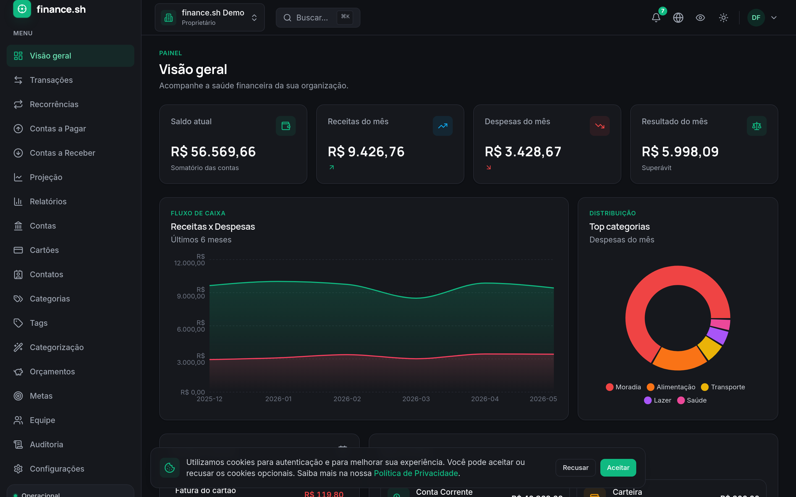
  </a>
  <br/><sub><b>Dashboard</b> — saldo, fluxo de caixa, top categorias.</sub>
</td>
<td width="33%" align="center">
  <a href="screenshots/03-transactions.png">
    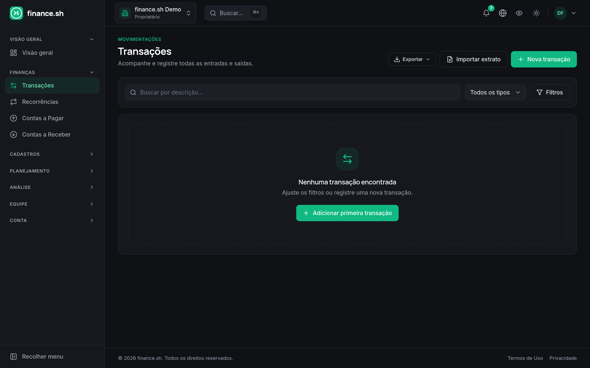
  </a>
  <br/><sub><b>Transações</b> — lista filtrável + tags + busca.</sub>
</td>
<td width="33%" align="center">
  <a href="screenshots/05-cartoes-faturas.png">
    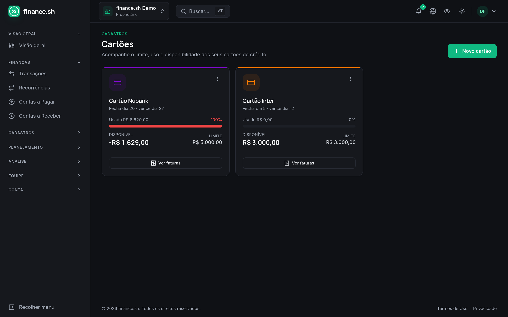
  </a>
  <br/><sub><b>Cartões</b> — limite, uso, ciclo de faturas.</sub>
</td>
</tr>
<tr>
<td width="33%" align="center">
  <a href="screenshots/06-relatorios.png">
    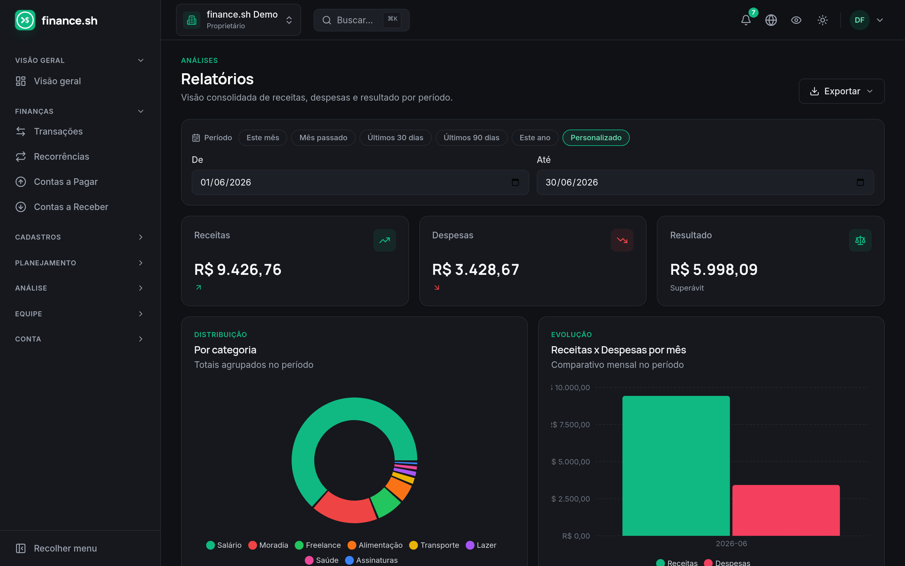
  </a>
  <br/><sub><b>Relatórios</b> — exportação Excel/PDF/CSV.</sub>
</td>
<td width="33%" align="center">
  <a href="screenshots/10-projecao-fluxo.png">
    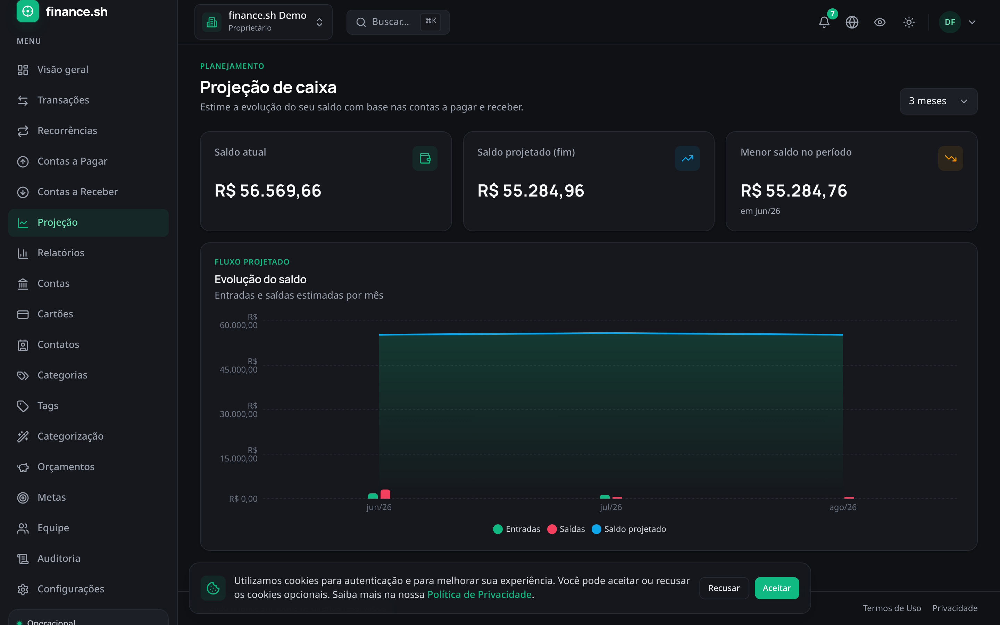
  </a>
  <br/><sub><b>Projeção</b> — fluxo de caixa N meses à frente.</sub>
</td>
<td width="33%" align="center">
  <a href="screenshots/11-orcamentos.png">
    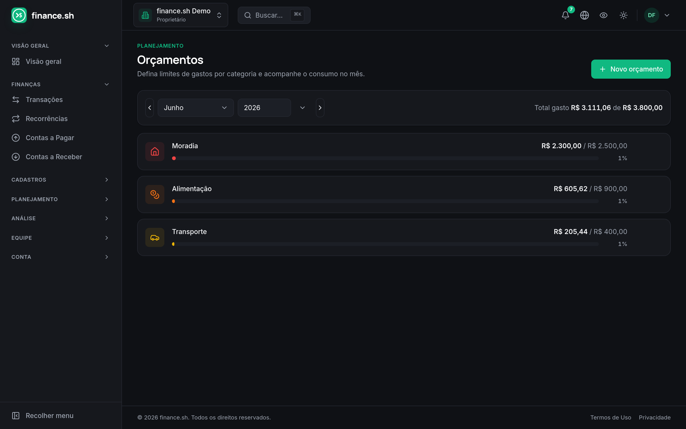
  </a>
  <br/><sub><b>Orçamentos</b> — meta mensal por categoria.</sub>
</td>
</tr>
<tr>
<td width="33%" align="center">
  <a href="screenshots/12-contas-a-pagar.png">
    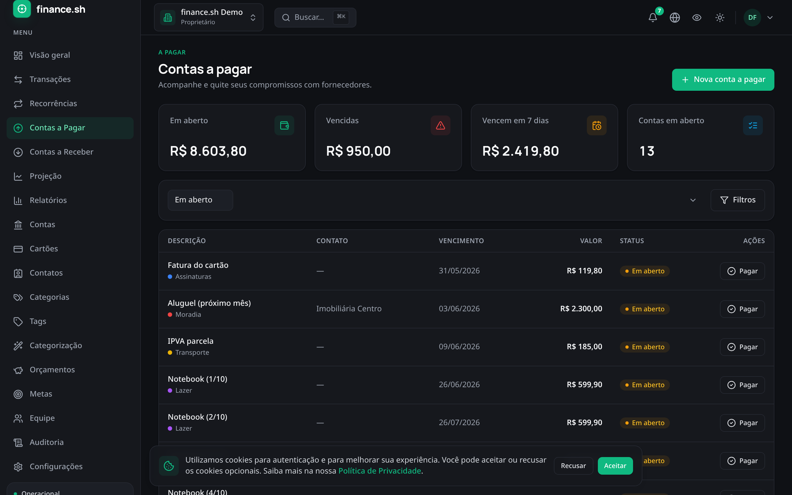
  </a>
  <br/><sub><b>Contas a pagar</b> — vencimentos e baixa.</sub>
</td>
<td width="33%" align="center">
  <a href="screenshots/13-recorrencias.png">
    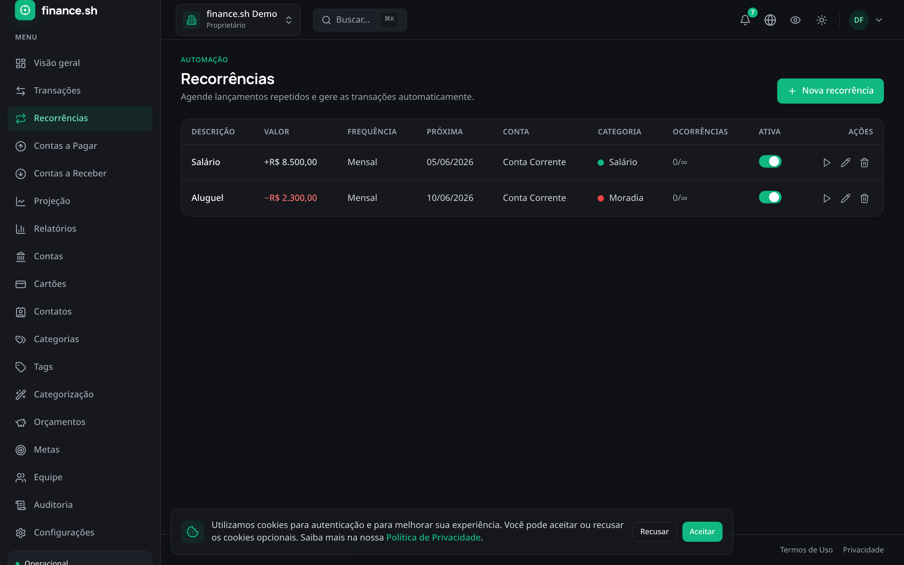
  </a>
  <br/><sub><b>Recorrências</b> — regras, scheduler in-process gera ocorrências.</sub>
</td>
<td width="33%" align="center">
  <a href="screenshots/07-settings-edition.png">
    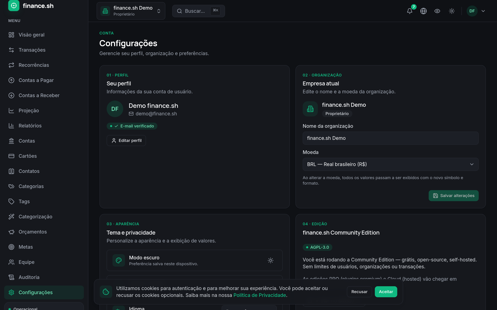
  </a>
  <br/><sub><b>Configurações</b> — open-source AGPL-3.0, sem limites.</sub>
</td>
</tr>
<tr>
<td width="33%" align="center">
  <a href="screenshots/08-admin.png">
    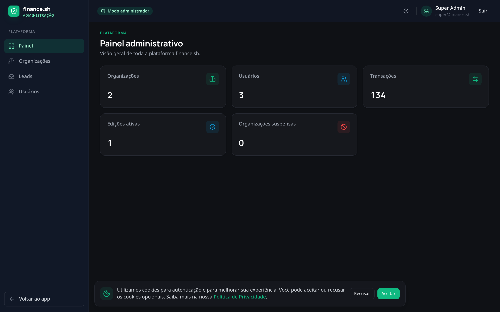
  </a>
  <br/><sub><b>Painel administrativo</b> — visão da plataforma.</sub>
</td>
<td width="33%" align="center">
  <a href="screenshots/00-landing.png">
    
  </a>
  <br/><sub><b>Landing</b> — página de marketing (deploy externo).</sub>
</td>
<td width="33%" align="center">
  <a href="screenshots/09-mobile-dashboard.png">
    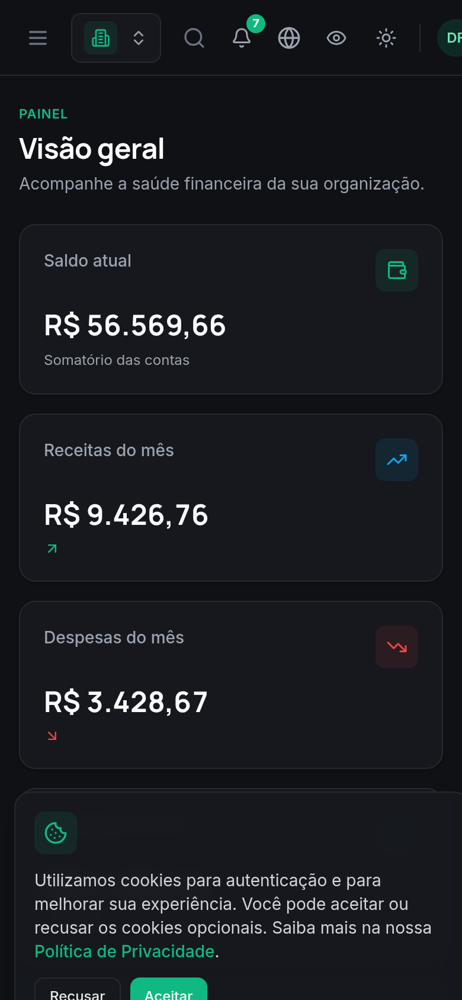
  </a>
  <br/><sub><b>Mobile / PWA</b> — instalável no celular.</sub>
</td>
</tr>
</table>

> Para ver ao vivo com dados de exemplo, suba em modo de desenvolvimento
> com `SEED=true` e entre com `demo@finance.sh` / `senha123`
> (veja [Credenciais de demonstração](INSTALACAO.md#credenciais-de-demonstração-só-dev)).
